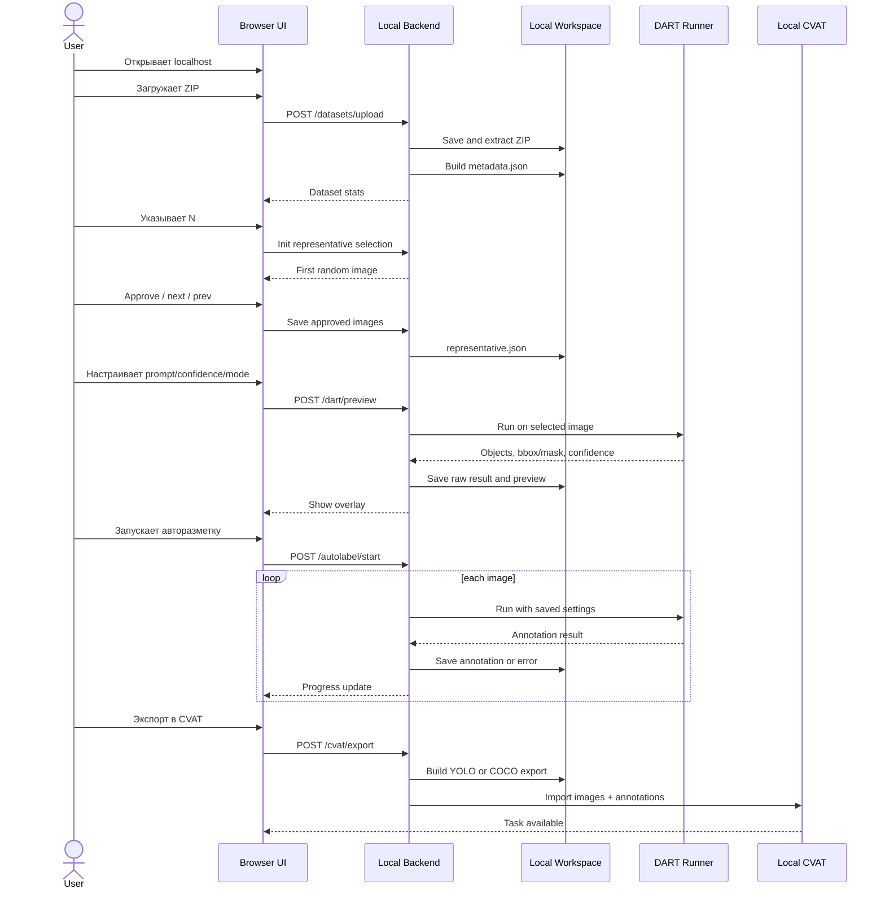
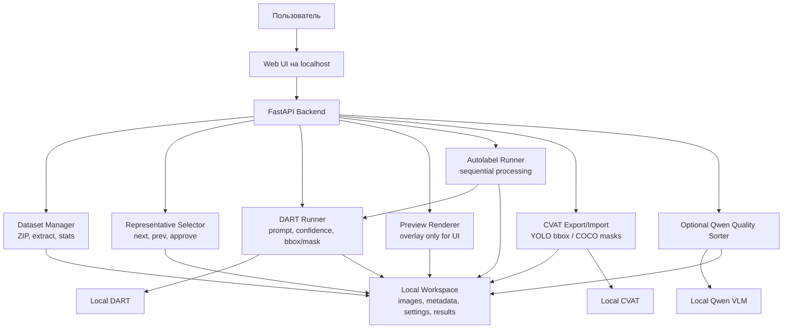

# Архитектура локального веб-сервиса авторазметки с DART и импортом в CVAT

## 1. Назначение проекта

Проект должен быть простым end-to-end прототипом, а не промышленной ML-платформой. Главная цель: локально запустить DART, дать пользователю удобную веб-форму для проверки настроек авторазметки на репрезентативных изображениях, затем разметить небольшой датасет и импортировать результат в локальный CVAT.

Что должно получиться:

- локальный веб-сервис, открываемый через `localhost:порт`;
- загрузка датасета изображений через `.zip`;
- базовая статистика по датасету;
- ручной отбор N репрезентативных изображений;
- настройка DART на выбранных изображениях: prompt, confidence, bbox/mask;
- preview-отрисовка результата в интерфейсе;
- последовательная авторазметка всего небольшого датасета;
- экспорт машинно-читаемой разметки;
- импорт исходных изображений и аннотаций в локальный CVAT.

Важно: в CVAT должны попадать не preview-картинки с нарисованными рамками, а исходные изображения и настоящая разметка в поддерживаемом формате.

## 2. Что не входит в базовую версию

В этой версии не нужно делать:

- поддержку нескольких инструментов авторазметки кроме DART;
- обучение собственной модели;
- сложную авторизацию и роли;
- Kubernetes, распределенные очереди, production-инфраструктуру;
- обработку огромных датасетов;
- параллельный batch inference;
- полноценный benchmark нескольких моделей;
- обязательное VLM-ревью.

Дополнительный Qwen-блок можно делать только после того, как основной путь DART -> веб-сервис -> авторазметка -> CVAT уже работает.

---

## 3. Общая архитектура

```text
Browser UI
   |
   v
Local Backend API
   |
   +-- Dataset Manager
   +-- Representative Selector
   +-- DART Runner
   +-- Preview Renderer
   +-- Autolabel Runner
   +-- CVAT Export/Import Adapter
   +-- Optional Qwen Quality Sorter
   |
   v
Local Workspace on Disk
   |
   +-- uploaded archives
   +-- extracted images
   +-- dataset metadata
   +-- selected representative images
   +-- DART settings
   +-- raw DART results
   +-- preview images
   +-- CVAT export files
```

Рекомендуемый стек:

| Часть | Рекомендация |
|---|---|
| Frontend | React/Vite или простые HTML-шаблоны |
| Backend | FastAPI |
| Хранение состояния | SQLite + файлы JSON или только JSON для MVP |
| Работа с изображениями | Pillow/OpenCV |
| Запуск DART | Python wrapper или subprocess |
| CVAT | локальный CVAT через Docker Compose |
| Интеграция с CVAT | `cvat-sdk`, REST API или подготовка импортируемого архива |
| Optional Qwen | локальный запуск через llama.cpp, если реально поддерживается image input |

Для учебного прототипа лучше выбрать простую архитектуру: один backend-процесс, локальная рабочая папка, последовательная обработка изображений. Это проще отладить, показать и воспроизвести.

---

## 4. Основные компоненты

### 4.1 Browser UI

Зачем нужен: пользователь должен работать не со скриптами, а с локальной веб-страницей.

Основные экраны:

| Экран | Что делает |
|---|---|
| Загрузка датасета | Принимает `.zip`, показывает статус распаковки |
| Статистика | Показывает число изображений, размеры, расширения, предупреждения |
| Отбор кадров | Показывает одно изображение, кнопки вперед/назад, approve/unapprove |
| Настройка DART | Prompt, confidence, режим bbox/mask, кнопка preview |
| Авторазметка | Запуск обработки всего датасета, прогресс, ошибки |
| Экспорт в CVAT | Подготовка формата и импорт/инструкция |
| Результаты | Ссылки на JSON, preview, CVAT export, список ошибок |

Интерфейс не обязан быть красивым. Важнее понятность и линейный сценарий демонстрации.

### 4.2 Backend API

Зачем нужен: backend принимает архив, хранит состояние проекта, вызывает DART и готовит результаты для CVAT.

Ответственность:

- загрузить `.zip`;
- безопасно распаковать архив;
- найти изображения;
- посчитать статистику;
- хранить список просмотренных и approved изображений;
- запускать DART на одном изображении для preview;
- запускать DART на всем датасете;
- сохранять raw и normalized результаты;
- экспортировать разметку в формат CVAT.

### 4.3 Dataset Manager

Функции:

- создать рабочую папку датасета;
- распаковать архив;
- отфильтровать поддерживаемые изображения: `.jpg`, `.jpeg`, `.png`, `.bmp`, `.webp`;
- игнорировать служебные файлы;
- посчитать количество изображений;
- прочитать width/height;
- найти минимальное, максимальное и частые разрешения;
- вернуть предупреждения.

Ограничение MVP: датасет примерно 100-150 изображений. Если архив слишком большой, сервис должен показать понятную ошибку или предупреждение, а не падать.

### 4.4 Representative Selector

Зачем нужен: выбранные изображения используются для настройки DART на характерных случаях датасета.

Логика:

- пользователь указывает N;
- сервис показывает одно изображение за раз;
- при движении вперед выбирается случайное еще не просмотренное изображение;
- назад возвращает к уже показанным;
- approve добавляет изображение в набор;
- снятие approve уменьшает счетчик;
- повторный approve не должен увеличивать счетчик дважды.

Если изображений меньше или столько же, сколько N, этап можно пропустить и считать все изображения репрезентативными.

### 4.5 DART Runner

Зачем нужен: изолирует веб-сервис от деталей запуска DART.

Минимальный интерфейс:

```python
class DartRunner:
    def run_image(
        self,
        image_path: str,
        prompt: str,
        confidence: float,
        mode: str
    ) -> DartResult:
        ...
```

`mode`:

- `bbox`;
- `mask`;
- возможно `bbox_and_mask`, если DART это поддерживает.

DART Runner должен возвращать не картинку, а структуру:

```json
{
  "image_id": "img_001",
  "objects": [
    {
      "label": "bolt",
      "confidence": 0.87,
      "bbox": {"x": 120, "y": 80, "width": 40, "height": 35},
      "mask": null
    }
  ],
  "settings": {
    "prompt": "bolt",
    "confidence": 0.35,
    "mode": "bbox"
  }
}
```

Preview-изображение с нарисованными bbox/mask создается отдельно и используется только для просмотра.

### 4.6 Preview Renderer

Функции:

- взять исходное изображение;
- наложить bbox или mask;
- подписать label/confidence;
- сохранить preview в рабочую папку;
- вернуть URL для отображения в UI.

Важно: preview не является результатом разметки для CVAT. Это только визуальная проверка.

### 4.7 Autolabel Runner

Функции:

- взять последние подтвержденные настройки DART;
- последовательно пройти по изображениям датасета;
- вызвать DART для каждого изображения;
- сохранить результат;
- сохранить preview, если включено;
- записать ошибки по отдельным файлам;
- показывать прогресс.

Для MVP достаточно последовательной обработки по одному изображению. Если одно изображение упало, лучше сохранить ошибку и продолжить следующие.

### 4.8 CVAT Export/Import Adapter

Зачем нужен: отделяет внутренний формат DART от форматов CVAT.

Для bbox:

- можно готовить YOLO-format;
- нужно корректно переводить абсолютные пиксели в нормализованные координаты YOLO;
- нужно следить за шириной и высотой изображения.

Для segmentation:

- желательно готовить COCO-compatible segmentation;
- если DART отдает бинарную маску, ее нужно преобразовать в annotation format, например RLE/polygon;
- нельзя просто загрузить картинку с залитой маской.

Варианты интеграции:

1. Подготовить архив в формате, который CVAT импортирует вручную.
2. Использовать `cvat-sdk`.
3. Использовать REST API CVAT.

Для MVP можно начать с надежного экспортного архива и documented manual import. Если хватит времени, добавить автоматический импорт через SDK.

---

## 5. Pipeline работы

```text
1. Проверить локальный DART на одной картинке
2. Запустить веб-сервис на localhost
3. Загрузить ZIP с датасетом
4. Распаковать и показать статистику
5. Указать N репрезентативных изображений
6. Отобрать изображения через approve
7. Настроить DART на выбранных изображениях
8. Запустить авторазметку всего датасета
9. Подготовить CVAT export
10. Импортировать изображения и аннотации в CVAT
11. Сохранить README, настройки и результаты
```

### 5.1 Проверка DART

Вход: одно тестовое изображение, prompt, confidence, mode.

Выход:

- raw result;
- normalized result;
- preview-картинка;
- инструкция запуска.

Ошибки:

- не найдены веса;
- несовместимые версии CUDA/PyTorch;
- DART возвращает неожиданный формат;
- режим mask не поддерживается.

### 5.2 Загрузка датасета

Вход: `.zip`.

Выход:

- рабочая папка датасета;
- список изображений;
- статистика.

Ошибки:

- архив поврежден;
- изображений нет;
- слишком большой архив;
- неподдерживаемые форматы.

### 5.3 Отбор репрезентативных изображений

Вход: список изображений, N.

Выход:

- список approved image IDs;
- история просмотренных изображений.

Ошибки:

- N больше количества изображений;
- пользователь не набрал N;
- изображение не открывается.

### 5.4 Настройка DART

Вход: selected images, prompt, confidence, mode.

Выход:

- preview для каждого проверенного изображения;
- последняя сохраненная конфигурация DART.

Ошибки:

- DART timeout;
- пустой результат;
- некорректная маска;
- неверная отрисовка координат.

### 5.5 Авторазметка всего датасета

Вход: весь датасет, последние настройки DART.

Выход:

- `annotations_internal.json`;
- `errors.json`;
- preview-папка;
- экспорт для CVAT.

Ошибки:

- отдельная картинка не обработалась;
- DART вернул невалидные координаты;
- недостаточно памяти;
- пользователь остановил обработку.

### 5.6 Импорт в CVAT

Вход:

- исходные изображения;
- YOLO или COCO export;
- labels/classes.

Выход:

- CVAT task/project с изображениями и аннотациями.

Ошибки:

- CVAT не запущен;
- неправильный формат импорта;
- bbox уехали из-за ошибки координат;
- mask загружена как картинка, а не annotation.

---

## 6. Хранение проекта на диске

Для MVP не обязательно поднимать PostgreSQL или object storage. Достаточно рабочей папки и, при желании, SQLite.

Рекомендуемая структура:

```text
workspace/
  datasets/
    {dataset_id}/
      upload/
        original.zip
      images/
        img_001.jpg
        img_002.jpg
      metadata.json
      representative.json
      dart_settings.json
      results/
        annotations_internal.json
        errors.json
        raw/
          img_001.json
        previews/
          img_001_preview.jpg
      cvat_export/
        yolo/
        coco/
  logs/
  README_generated.md
```

Что сохранять обязательно:

- инструкцию запуска веб-сервиса;
- инструкцию запуска DART и путь к весам;
- metadata датасета;
- список выбранных репрезентативных изображений;
- последние настройки DART;
- результаты авторазметки;
- экспортные файлы для CVAT;
- инструкцию запуска CVAT и загрузки разметки.

---

## 7. Минимальная схема данных

Можно хранить в SQLite или JSON.

### Dataset

```json
{
  "id": "ds_001",
  "name": "bolts_dataset",
  "status": "READY",
  "image_count": 120,
  "created_at": "2026-07-03T10:00:00",
  "warnings": []
}
```

### ImageItem

```json
{
  "id": "img_001",
  "filename": "001.jpg",
  "path": "workspace/datasets/ds_001/images/001.jpg",
  "width": 1920,
  "height": 1080,
  "approved": true,
  "viewed": true
}
```

### DartSettings

```json
{
  "prompt": "bolt",
  "confidence": 0.35,
  "mode": "bbox",
  "show_overlay": true,
  "updated_at": "2026-07-03T10:20:00"
}
```

### Annotation

```json
{
  "image_id": "img_001",
  "objects": [
    {
      "label": "bolt",
      "confidence": 0.87,
      "bbox": {"x": 120, "y": 80, "width": 40, "height": 35},
      "mask": null
    }
  ]
}
```

---

## 8. Минимальный REST API

```text
POST /api/datasets/upload
GET  /api/datasets/{dataset_id}
GET  /api/datasets/{dataset_id}/images
GET  /api/datasets/{dataset_id}/stats

POST /api/datasets/{dataset_id}/representative/init
GET  /api/datasets/{dataset_id}/representative/current
POST /api/datasets/{dataset_id}/representative/next
POST /api/datasets/{dataset_id}/representative/prev
POST /api/datasets/{dataset_id}/representative/approve
POST /api/datasets/{dataset_id}/representative/unapprove

GET  /api/datasets/{dataset_id}/dart/settings
POST /api/datasets/{dataset_id}/dart/settings
POST /api/datasets/{dataset_id}/dart/preview

POST /api/datasets/{dataset_id}/autolabel/start
GET  /api/datasets/{dataset_id}/autolabel/status
POST /api/datasets/{dataset_id}/autolabel/stop

POST /api/datasets/{dataset_id}/cvat/export
POST /api/datasets/{dataset_id}/cvat/import
GET  /api/datasets/{dataset_id}/results
```

Пример запроса preview:

```json
{
  "image_id": "img_001",
  "prompt": "bolt",
  "confidence": 0.35,
  "mode": "bbox"
}
```

Пример ответа:

```json
{
  "status": "OK",
  "objects_count": 3,
  "preview_url": "/static/datasets/ds_001/results/previews/img_001_preview.jpg",
  "result": {
    "objects": [
      {
        "label": "bolt",
        "confidence": 0.87,
        "bbox": {"x": 120, "y": 80, "width": 40, "height": 35}
      }
    ]
  }
}
```

---

## 9. Форматы разметки

### Internal format

Внутренний формат должен быть один для bbox и mask. Он нужен, чтобы не зависеть напрямую от формата DART или CVAT.

```json
{
  "image": {
    "id": "img_001",
    "filename": "001.jpg",
    "width": 1920,
    "height": 1080
  },
  "objects": [
    {
      "label": "bolt",
      "confidence": 0.87,
      "bbox": {"x": 120, "y": 80, "width": 40, "height": 35},
      "mask": null
    }
  ]
}
```

### YOLO bbox

YOLO использует нормализованные координаты:

```text
class_id x_center_norm y_center_norm width_norm height_norm
```

Если DART возвращает bbox в пикселях:

```text
x_center_norm = (x + width / 2) / image_width
y_center_norm = (y + height / 2) / image_height
width_norm    = width / image_width
height_norm   = height / image_height
```

Типичная ошибка: перепутать абсолютные пиксели и нормализованные координаты. В CVAT это видно сразу: рамки оказываются в углу, слишком большие или сильно смещенные.

### COCO segmentation

Для масок нужен COCO-compatible формат:

- `images`;
- `annotations`;
- `categories`;
- `segmentation`;
- `bbox`;
- `area`;
- `iscrowd`.

Если DART возвращает бинарную маску, ее нужно преобразовать в RLE или polygon. Preview-картинка с заливкой не подходит для CVAT как аннотация.

---

## 10. Optional: Qwen сортировка качества

Этот блок не является обязательным.

Идея: после DART-авторазметки пользователь включает чекбокс “категоризировать разметку с Qwen”. Сервис берет preview-изображение с bbox/mask, передает его локальной VLM-модели и получает одну из трех категорий:

| Категория | Значение |
|---|---|
| good | Разметка близка к верной |
| partial | Разметка частично верная |
| bad | Разметка явно ошибочная |

Ответ лучше просить в JSON:

```json
{
  "category": "partial",
  "explanation": "Найдена часть объектов, но несколько целевых объектов пропущены."
}
```

Если Qwen-блок реализован, можно создать три CVAT-задачи:

- `dataset_qwen_good`;
- `dataset_qwen_partial`;
- `dataset_qwen_bad`.

Ограничения:

- Qwen оценивает preview, а не raw mask/bbox;
- качество overlay влияет на оценку;
- Qwen не заменяет человека-разметчика;
- если локальная модель не принимает изображения, блок нельзя считать выполненным.

---

## 11. Sequence Diagram



---

## 12. Итоговая диаграмма



---

## 13. Критерии готовности

Проект готов на базовом уровне, если:

| Блок | Что должно работать |
|---|---|
| DART | Локальный запуск на одной картинке, понятный JSON/preview, инструкция |
| Веб-форма | Открывается через localhost, принимает ZIP |
| Статистика | Показывает число изображений, размеры, расширения, предупреждения |
| Отбор кадров | Есть вперед/назад, approve, снятие approve, счетчик N |
| Настройка DART | Prompt, confidence, bbox/mask, показать/скрыть overlay |
| Авторазметка | Обрабатывает небольшой датасет, показывает прогресс, сохраняет ошибки |
| CVAT | В локальном CVAT видны исходные изображения и настоящая разметка |
| Воспроизводимость | Есть README, настройки, результаты и инструкция импорта |

Главный критерий: не идеальная точность DART, а понятный воспроизводимый путь от датасета до CVAT.

---

## 14. Что показать на финальной демонстрации

1. Открыть веб-сервис через localhost.
2. Загрузить ZIP с изображениями.
3. Показать статистику датасета.
4. Указать N репрезентативных изображений.
5. Отобрать несколько изображений через approve.
6. Открыть настройку DART.
7. Изменить prompt/confidence.
8. Включить и выключить overlay.
9. Переключиться между выбранными изображениями.
10. Запустить авторазметку всего небольшого датасета.
11. Показать прогресс и сохраненные результаты.
12. Открыть локальный CVAT.
13. Показать импортированную задачу с разметкой.
14. Если сделан Qwen-блок, показать три корзины качества.

---

## 15. Риски и решения

| Риск | Решение |
|---|---|
| DART сложно запустить из-за весов/CUDA | Сначала сделать отдельный воспроизводимый скрипт и README |
| DART возвращает нестабильный формат | Сделать normalization layer |
| Архив слишком большой | Ограничить размер и число изображений, показать предупреждение |
| Изображения разных форматов | Поддержать базовые форматы, остальные игнорировать с warning |
| UI зависает во время авторазметки | Запускать обработку в background thread/process, отдавать progress |
| Ошибка на одном изображении валит весь run | Логировать ошибку и продолжать |
| bbox неверно импортируются в CVAT | Централизовать conversion pixel -> YOLO normalized |
| mask импортируется как картинка | Конвертировать mask в COCO RLE/polygon |
| Qwen не принимает изображения | Не включать Qwen-блок в готовность MVP |

---


